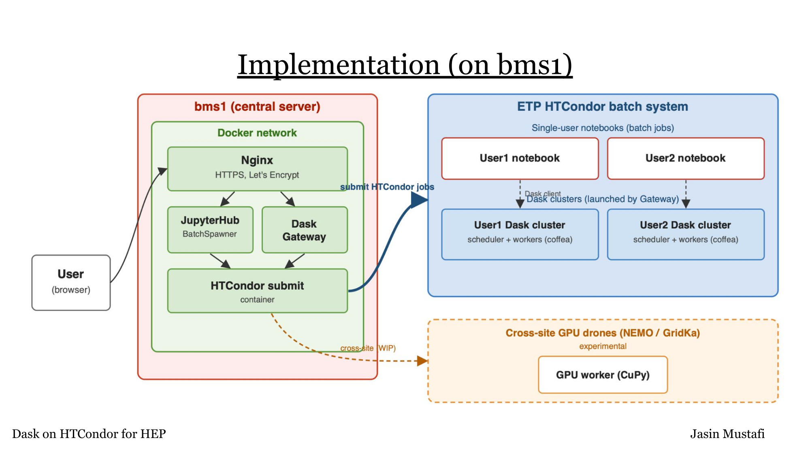

# Admin-Dokumentation: JupyterHub/HTCondor/Dask-Gateway-Stack

Self-hosted JupyterHub für HEP-Analysen am KIT/ETP, HTCondor-Batchsystem, Dask Gateway.

- Host: `bms1.etp.kit.edu`
- Compose-Projekt: `jupyterhub-htcondor`
- Bei Problemen: `admin-dokumentation-troubleshooting.md`

## Architektur

Browser → Nginx (TLS) → Hub bzw. Gateway → HTCondor-Submit → Batch-Job (Notebook bzw. Dask-Scheduler/-Worker) auf Execute-Node.

## 1. Docker-Images

| Image | Läuft als | Zweck |
|---|---|---|
| `jupy/Dockerfile` | Compose `jupyterhub` | Hub, submitted Notebook-Jobs |
| `jupy/notebook/Dockerfile` | HTCondor-Job | Single-User-Notebook |
| `nginx/Dockerfile` | Compose `nginx` | TLS, Reverse-Proxy |
| `rocky/Dockerfile` | Compose `htrocky` | Dask-Gateway + Condor-Submit |
| `coffea-backup/Dockerfile` | Docker-Hub-Image | Dask-Worker/Scheduler |

Vor jedem Rebuild: Nutzeraktivität prüfen (`admin-dokumentation-deploy-betrieb.md`).

## 2. Logfiles

| Was | Ort |
|---|---|
| Compose-Services | `docker compose logs <service>` |
| Notebook-Job | `~/.jupyterhub.condor.{out,err,log}` im User-Home |
| Dask-Cluster-Job | `/var/lib/dask-gateway/<user>/htcondor/<cluster-id>/` |
| HTCondor-Daemons | `/var/log/condor/` auf dem Host (nicht im Container) |
| Certbot | `/var/log/letsencrypt/letsencrypt.log` |

`condor_master` läuft auf dem Host, nicht in `htrocky` — `htrocky`/`jupyterhub` sind reine Submit-Clients (`network_mode: host`).

## 3. Netzwerk

| Port | Service | Erreichbar | Zweck |
|---|---|---|---|
| 443/80 | nginx | öffentlich | TLS / Let's-Encrypt-Challenge |
| 8000 | htrocky | nur ETP-Subnetz | Gateway-API + Scheduler-Proxy |
| 8081 | jupyterhub | nicht cross-node | Hub-interne API, umgangen via öffentlichen 443-Pfad |
| 9618 | Condor (Host) | ETP-intern | Collector/Schedd |

`jupyterhub`/`htrocky`: `network_mode: host`. Notebook-/Dask-Jobs auf Execute-Nodes: `docker_network_type = host` im JDL (sonst unerreichbar wegen Docker-Bridge-Networking).

## 4. Persistenz

| Was | Wo |
|---|---|
| Hub-DB, Cookie-Secret, `auth_state.key` | Docker-Volume `hub-state` → `/srv/jupyterhub/state` |
| Pool-Auth | vom Host gemountet |
| Dask-Staging | `/var/lib/dask-gateway/<user>/`, 1777 |
| `/home` etc. | komplett auf Execute-Node gemountet |
